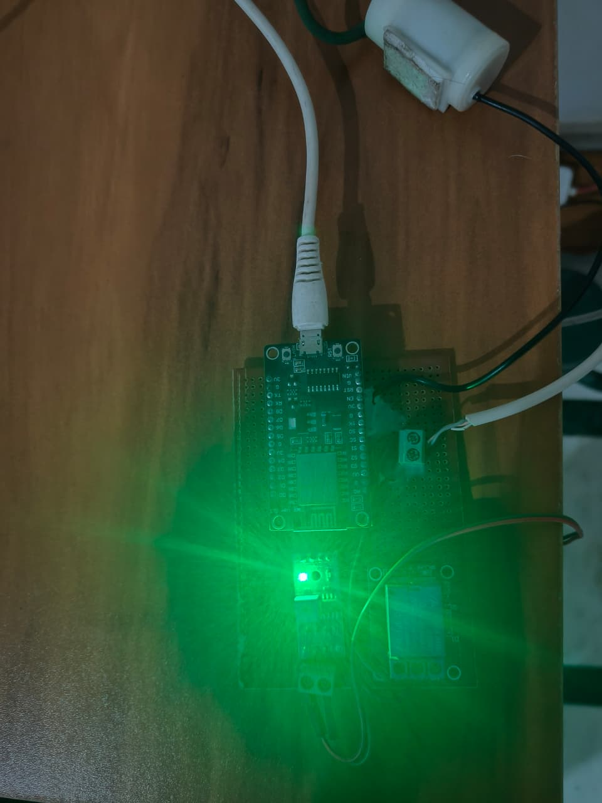

# 🌱 Smart Irrigation System

An intelligent IoT irrigation system that combines **ESP8266 hardware** with an **Android mobile app** and **AI-powered recommendations** to optimize plant watering.

<table>
      <tr>
            <td align="center" width="50%">
                  <b>Demo Video</b><br />
                  <video src="https://github.com/user-attachments/assets/7522783a-e532-47e7-ab23-1a4c875bb935" controls width="100%"></video>
            </td>
            <td align="center" width="50%">
                  <b>ESP Device</b><br />
                  
            </td>
      </tr>
</table>
## 🎯 Overview

The Smart Irrigation System monitors soil moisture in real-time and controls a water pump automatically or manually. The system features an AI assistant that provides intelligent threshold recommendations based on plant type and location.

### How It Works

```
┌─────────────┐         WiFi/HTTP          ┌──────────────┐
│   ESP8266   │ ◄────────────────────────► │  Android App │
│  + Sensors  │    SSE Stream + REST API   │   + AI Bot   │
└─────────────┘                             └──────────────┘
      │                                            │
      ├─ Soil Moisture Sensor                     ├─ Real-time Monitoring
      ├─ Relay (Pump Control)                     ├─ Manual/Auto Control
      └─ WiFi Communication                       └─ AI Recommendations
```

**Communication Flow:**
1. **ESP8266** continuously reads soil moisture and sends updates via **Server-Sent Events (SSE)**
2. **Android App** receives real-time data and displays current status
3. **User** can manually control pump or switch to automatic mode
4. **AI Chatbot** analyzes plant type + location → recommends optimal threshold
5. **App** sends HTTP requests to ESP8266 to control pump/mode/threshold

---

## 📁 Project Structure

```
Smart_Irrigation/
├── Android/              # 📱 Android Mobile Application
│   ├── app/             # Main app module (Kotlin + Jetpack Compose)
│   ├── gradle/          # Build system
│   └── README.md        # Android development guide
│
├── Arduino/             # 🔌 ESP8266 Firmware
│   ├── main/           # Arduino sketch (.ino)
│   └── README.md       # Hardware setup & API docs
│
├── LICENSE             # Project license
└── README.md           # This file
```

---

## ✨ Features

### 🌡️ Real-time Monitoring
- Live soil moisture readings (0-100%)
- Current pump status (ON/OFF)
- Connection status indicator
- Automatic reconnection on network issues

### 💧 Smart Control Modes

#### Automatic Mode
- ESP8266 monitors soil moisture continuously
- Automatically turns pump ON when moisture < threshold
- Turns pump OFF when moisture ≥ threshold
- Hands-free irrigation

#### Manual Mode
- User controls pump directly from app
- Override automatic behavior
- Useful for testing or special watering needs

### 🤖 AI-Powered Recommendations *(Planned)*
The chatbot feature will:
- Accept **plant name** (e.g., "Tomato", "Rose", "Cactus")
- Accept **location** (city/region for climate data)
- Analyze plant water requirements
- Consider local climate conditions
- **Recommend optimal moisture threshold**
- **Automatically set threshold** on user confirmation

**Example Interaction:**
```
User: "I'm growing tomatoes in Mumbai"
AI: "Tomatoes in Mumbai's climate need moderate watering. 
     I recommend a threshold of 45%. Shall I set it for you?"
User: "Yes"
AI: ✓ Threshold set to 45%
```

### ⚙️ Customization
- Set custom moisture thresholds (0-100%)
- Configure plant preferences
- Manage notifications
- Dark mode support

---

## 🛠️ Technology Stack

### Android App
- **Language**: Kotlin
- **UI**: Jetpack Compose (Material 3)
- **Architecture**: Clean Architecture + MVVM
- **DI**: Dagger Hilt
- **Networking**: Ktor Client (HTTP + SSE)
- **Storage**: DataStore Preferences
- **Async**: Coroutines + Flow

### ESP8266 Hardware
- **Microcontroller**: ESP8266 (NodeMCU/Wemos D1)
- **Sensors**: Capacitive/Resistive Soil Moisture Sensor
- **Actuator**: Relay Module (for pump control)
- **Communication**: WiFi (HTTP Server + SSE)
- **Power**: 5V USB or external supply

---

## 🚀 Quick Start

### Prerequisites
- **Android**: Device running Android 7.0+ (API 24+)
- **ESP8266**: NodeMCU or compatible board
- **Network**: Both devices on same WiFi network

### 1️⃣ Setup ESP8266 Hardware

1. Connect components:
   - Soil moisture sensor → ESP8266 analog pin
   - Relay module → ESP8266 digital pin
   - Water pump → Relay output

2. Flash firmware:
   ```bash
   cd Arduino/main/
   # Open main.ino in Arduino IDE
   # Configure WiFi credentials
   # Upload to ESP8266
   ```

3. Note the ESP8266's IP address from Serial Monitor

📖 **Detailed guide**: [Arduino/README.md](Arduino/README.md)

### 2️⃣ Setup Android App

1. Open Android Studio
2. Open the `Android/` folder
3. Update ESP8266 IP in `IrrigationRepoImpl.kt`:
   ```kotlin
   private const val BASE_URL = "http://YOUR_ESP_IP"
   ```
4. Build and install on your Android device

📖 **Detailed guide**: [Android/README.md](Android/README.md)

---

## 🔌 System Communication

### API Endpoints (ESP8266)

| Method | Endpoint | Description | Auth Required |
|--------|----------|-------------|---------------|
| GET | `/sse` | Server-Sent Events stream (real-time updates) | No |
| POST | `/setThreshold` | Set moisture threshold (0-1024) | Yes |
| POST | `/setMode` | Switch manual/auto mode | Yes |
| POST | `/setPump` | Turn pump ON/OFF (manual mode) | Yes |

**Authentication**: Bearer token (`myStrongAdminKey123`)

### SSE Stream Format
```javascript
data: {
  "threshold": 512,        // Current threshold (0-1024)
  "soilMoisture": 650,     // Current moisture (0-1024)
  "relayStatus": false,    // Pump state (true=ON)
  "mode": true            // true=manual, false=auto
}
```

### Request Examples

**Set Threshold:**
```http
POST http://192.168.1.150/setThreshold
Authorization: Bearer myStrongAdminKey123
Content-Type: application/json

{"threshold": 512}
```

**Switch to Auto Mode:**
```http
POST http://192.168.1.150/setMode
Authorization: Bearer myStrongAdminKey123
Content-Type: application/json

{"mode": false}
```

**Turn Pump ON:**
```http
POST http://192.168.1.150/setPump
Authorization: Bearer myStrongAdminKey123
Content-Type: application/json

{"pumpStatus": true}
```

---

## 🧠 AI Chatbot Architecture *(Planned)*

### Workflow
```
User Input (Plant + Location)
         ↓
   AI Analysis Engine
         ↓
   ┌─────────────────┐
   │ Plant Database  │ → Water requirements
   │ Climate API     │ → Local weather data
   │ ML Model        │ → Optimal threshold
   └─────────────────┘
         ↓
   Recommendation
         ↓
   User Confirmation
         ↓
   HTTP POST /setThreshold
         ↓
   ESP8266 Updates Threshold
```

### Inputs
- **Plant Name**: Type of plant being grown
- **Location**: City/region for climate context

### Outputs
- **Threshold Recommendation**: Optimal moisture percentage
- **Reasoning**: Why this threshold is recommended
- **Auto-Set Option**: One-tap threshold configuration

---

## 📊 System States

### Connection States
- **Connected**: Green indicator, live data streaming
- **Disconnected**: Red banner, attempting reconnection
- **Reconnecting**: Yellow indicator, retry in progress

### Operation Modes
- **Automatic**: ESP8266 controls pump based on threshold
- **Manual**: User controls pump via app

### Pump States
- **ON**: Actively irrigating
- **OFF**: Standby

---

## 🔐 Security Notes

- **Local Network Only**: System operates on local WiFi (no internet required)
- **Bearer Token Auth**: Protects control endpoints
- **No Cloud Dependency**: All data stays on local network
- **Cleartext HTTP**: Suitable for home networks (consider HTTPS for production)

---

## 🛣️ Roadmap

### Current Features ✅
- [x] Real-time soil moisture monitoring
- [x] Manual pump control
- [x] Automatic irrigation mode
- [x] Custom threshold settings
- [x] SSE-based live updates
- [x] Background service for persistent monitoring

### Planned Features 🚧
- [ ] **AI Chatbot Integration**
  - [ ] Plant database integration
  - [ ] Weather API integration
  - [ ] ML-based threshold recommendations
  - [ ] Conversational interface
  - [ ] Auto-threshold setting
- [ ] Historical data charts
- [ ] Irrigation scheduling
- [ ] Multi-device support
- [ ] Cloud sync (optional)
- [ ] Water usage analytics

---

## 🤝 Contributing

Contributions are welcome! Areas for improvement:
- AI chatbot implementation
- Additional sensor support
- UI/UX enhancements
- Documentation improvements

---

## 📄 License

See [LICENSE](LICENSE) file for details.

---

## 🆘 Troubleshooting

### App can't connect to ESP8266
- Ensure both devices are on same WiFi network
- Verify ESP8266 IP address is correct
- Check firewall settings
- Restart ESP8266 and app

### Pump not responding
- Verify relay connections
- Check power supply to pump
- Test relay manually
- Review ESP8266 serial logs

### Inaccurate moisture readings
- Calibrate sensor (dry vs wet soil)
- Check sensor connections
- Clean sensor probes
- Verify sensor type (capacitive recommended)

---

## 📞 Support

For issues or questions:
1. Check component READMEs ([Android](Android/README.md) | [Arduino](Arduino/README.md))
2. Review troubleshooting section
3. Open an issue on GitHub

---

**Built with ❤️ for smarter, more efficient irrigation**
